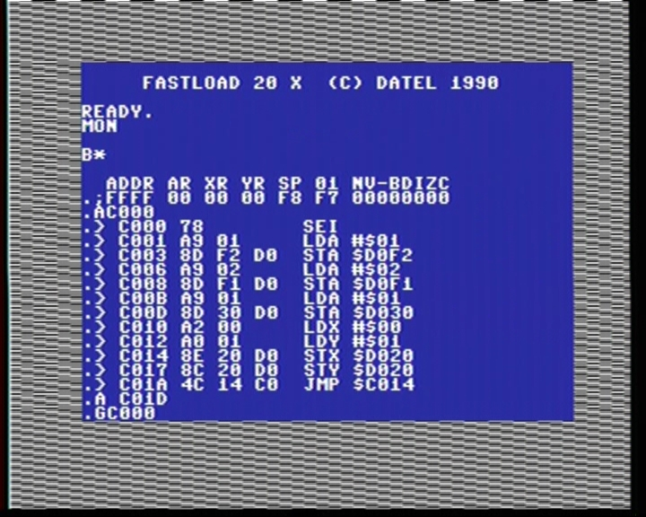
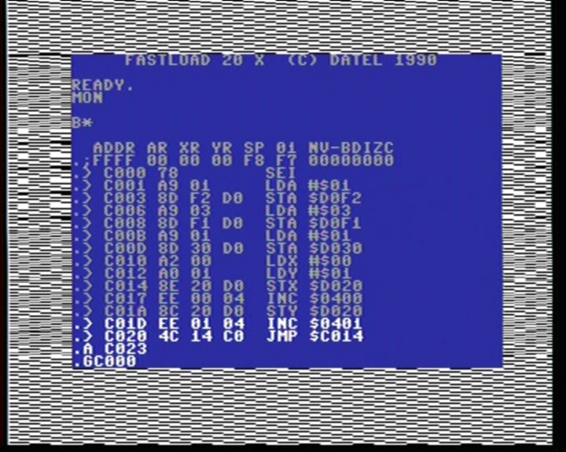

# Teensy64

This is a hardware MOS 6510 emulator with some additional features. It can be used as a drop-in replacement on any Commodore 64.

## Credits

The idea, circuit, 6510 bus interface and CPU emulator code: Ted Fried, [Micro Core Labs](https://github.com/MicroCoreLabs/Projects) (master branch)

Additional features: Maciej 'YTM/Elysium' Witkowiak (ytm-devel branch)

*This is not a repository fork because MCL projects are in a single repository and I can't clone just one of the folders from there. Be sure you visit the blog at [https://microcorelabs.wordpress.com](https://microcorelabs.wordpress.com).*

# Hardware

If CPU in your C64 is not socketed you need to desolder it and install a socket.

This project requires a Teensy 4.1 and an adapter PCB with logic circuitry to convert 5V logic from C64 side to 3.3V logic used by Teensy. 

The schematic and PCB design are available from MCL repository: https://github.com/MicroCoreLabs/Projects/tree/master/MCL64/PCB

# Configuration

*Note: this is not final*

Configuration registers are located at $d0f0. The first register is mirrored at $d030 to mimic C128 2MHz mode. All registers are R/W. Access to these registers is not cycle-exact.

|register:bits| description |
|--|--|
|$d030:0, $d0f0:0|when bit 0 is set and $d0f2:0 bit is set, then set speed to value from $d0f1, it operates much like C128 2MHz mode, but faster
|$d0f1:10 | mode number when speedup is enabled: 1, 2 or 3 |
|$d0f2:0  | clear: enable mode 0 and trigger RESET, set: enable speedup modes |
|$d0f2:1  | set: enable LOAD ($ffd5) trap for tape device for Tapecart emulation |
|$d0f2:2  | set: enable 512K REU emulation at $df00-$dfxx |

## Modes:

| mode | description |
|--|--|
| 0 | cycle exact, all accesses using external bus |
| 1 | cycle-exact, RAM is read from internal cache, all writes go through external bus |
| 2 | CPU optimizations enabled, RAM is read from internal cache as fast as possible but all writes go through external bus |
| 3 | CPU optimizations enabled, RAM is read/written using internal cache only, only I/O access goes through external bus |

"Internal cache" above means both RAM and copies of BASIC/KERNAL/cartridge ROM areas.

CPU optimizations remove unnecessary fetch/store operations performed by 6502 core making some instructions take fewer cycles.

In mode 3 no data is written to onboard RAM. This means you can't update screen data for VIC, you have to slow down to mode 2 or 1 for that.

*Note: this is not final, mode 0.5 could be useful too for $d030 speedup: with CPU optimizations but having all accesses going through the external bus*

## Configuration examples

For full C64 compatibility set $d0f2 to 0. This will set mode 0 - enable full external cartridge compatibility (Action Replay), turn off all speedups, REU and LOAD trap.
Writes to $d030 (C128 2MHz mode emulation) will be passed to VIC.

```
POKE 53490,0
```

For C128-in-C64-mode like experience the default configuration is to set $d0f2 to $01 (enable speedups, no REU nor LOAD trap) and $d0f1 to $02 (mode 2) or $03 (mode 3).
The fast mode from $d0f1 (1, 2 or 3) will be enabled only when C128 2MHz mode is set in $d030.

```
REM SETUP
POKE 53490,1 : REM ENABLE SPEEDUPS
POKE 53489,3 : REM MAXIMUM SPEED WHEN $D030 IS SET TO 1

REM FAST
POKE 53296,1

REM SLOW
POKE 53296,0
```

As long as $d030/$d0f0 bit 0 is clear the CPU will remain in mode 1, so cartridge like Action Replay will not be visible to the CPU.

## Code example

Consider this simple example for speed test:

```
    SEI
    LDA #$01 ; enable speedups
    STA $d0f2
    LDA #$02 ; mode 2 in fast mode
    STA $d0f1
    LDA #$01 ; enable fast code like on C128
    STA $d030
loop:
    INC $d020
    JMP loop
```

Even in the fastest modes 2 and 3 this would change the border colour every **two** cycles. This is because `INC` does one fetch from I/O and one store to I/O. 

However this code:
```
loop:
    STX $d020
    INX
    JMP loop
````

will change the border colour on every single cycle. There is only one I/O access in the loop.

These are screen captures from a real machine:

### Modes 0 and 1

Modes 0 and 1 look identical to stock C64:


The main difference between modes 0 and 1 is the bus access - in mode 1 Teensy can replace ROMs and provide virtual cartridge.

### Modes 2 and 3

Mode 2:



Mode 3:


There is no difference here because all the writes in the loop are going to I/O space ($d020) with no additional delay. 

We can see the difference is some extra RAM access is introduced. Let's write to I/O but also INC two values from RAM. INC means two bus accesses - one to read value and another one to write it.

Mode 2 with RAM access:


Mode 3 with RAM access:



For completeness, in modes 0, 1 the result looks like this:


# Default configuration

* Note: this is not final *

Right now Teensy starts with USB serial console enabled in mode 1 with REU and LOAD traps enabled. Press SHIFT+RUN/STOP to load SD card browser.

If your attached cartridge doesn't work (like Action Replay) this is because without reading from C64 bus it's invisible to Teensy CPU. Disable speedups and reset the machine:
```
POKE 53490,0
```

# Compatibility

6502 CPU core in mode 0 is supposed to be cycle-exact and compatible with all software and peripherals except tape due to missing $01 port bit I/O.

Serial port opened over USB connection steals some cycles from Teensy and may cause timing issues.

REU emulation is not complete and not cycle-exact.

## Freezer cartridges

An external Action Replay (real or virtual from UltimateII+) works only in mode 0. These devices are not visible to CPU in modes 1 and faster.
After switching the mode you have to do a hardware reset.

## Ultimate II+ and REU

U2+ autorun features (LOAD, RUN, DMA) use direct memory access that happens outside of CPU. Thus they don't work in mode 1 and faster.

The same applies to REU (both real and emulated by U2+) - the DMA operations will halt CPU and read/write directly to onboard DRAM.
This new data is only visible to CPU in mode 0.

# Serial console

*Note: this is not final*

Some commands are available in serial console over USB.

|command|descripton|
|---|---|
|0, 1, 2, 3 | unconditionally switch to specified mode |
| R | trigger CPU reset |
| e | set /EXROM to 0 and reset, this will activate 8k cartridge in $8000-$9fff |
| E | set /EXROM to 1 and reset, this will deactivate 8k cartrdge |
| t | test sequence, fill $0400-$04ff with values $00-$ff and put a short test program at $C000, start with SYS49152 |
| ? | show status and configuratio info |

There is a very simple machine code monitor available:

|command|descripton|
|---|---|
| m <addr> | dump 256 bytes starting at `$addr` or continue from the last used address |
| r | show CPU status and Teensy configuration |
| g addr | set CPU PC to `$addr` |

# NMI trap

There is a trap for NMI signal to trigger C64 takeover.

To trigger the trap you have to hit RESTORE key four times within one second.

This is meant to provide status and configuration menu, like freezer or menu button on UltimateII+.

Right now the only reaction to the trap is the test sequence (see serial commands).

# LOAD trap

Only lower 3 bits of CPU port at $01 are connected. The remaining three pins used by the tape interface are not connected at all.

If LOAD trap is enabled ($d0f2 bit 1 set) the LOAD from device 1 (tape) with no name will be intercepted and SD card file browser will be loaded.
This works just like Tapecart. You can browse through files and folders and instantly load & run any PRG file.

# Software possibilities

When the CPU and its view of memory model are completely under software control there are some new unique features possible:

- switching CPU core on the fly
    - 6502 (done)
    - 65C02
    - 65816/65802
    - Z80
    - 8080
    - 8086
    - 68000
 - fast and reliable CP/M on C64
 - C128 mode on C64
    - 128/256K RAM
    - C128 ROM set, internal/external function ROMs
    - MMU emulation - bank switching and memory splits, page 0/1 relocation 
    - fast Z80 core
 - RAM expansions (limited by Teensy64 RAM, without extra chip - at most 512K)
    - REU
    - +60K / +256K
    - GeoRAM (up to ~512K)
    - RamCart 64/128K
 - KERNAL ROM traps
    - redirect LOAD from tape, like [Tapecart](https://github.com/KimJorgensen/tapecart) so SHIFT+RUN/STOP instantly loads SD card file browser
    - speedup memory transfer routines (screen scroll?)
    - trap GEOS KERNAL jump table and replace functionality by native ARM code
 - KERNAL/BASIC ROM switching (stock, JiffyDOS, etc.)
 - 8/16k cartridges with banks, their ROMs stored with in firmware flash or loaded from SD card
 - freezer cartridge emulation
 - diagnostics
    - built-in diagnostic cartridge
    - trap JAM opcode and redirect to built-in machine code monitor
    - hardware testing mode [MCL64_Tester](https://github.com/MicroCoreLabs/Projects/tree/master/MCL64_Tester)
 - remote debugging
    - remote machine code monitor over USB serial port or Ethernet (example done) (like VICE)
    - gdb serial remote protocol (for emulated CPU, not Teensy itself)
 - web interface over ethernet
    - configuration control
    - remote access: view the C64 screen, send keyboard/joystick events

# Hardware ideas

- redesign the PCB to make SD card stick out of the back of C64 case
- handle the missing 3 CPU port bits, they need to be bidirectional
- optional 8502 pinout for C128 board version
- keep the original 6510 on the adapter board too (with gated /RDY signal?) and allow it to take over from Teensy64, for 100% compatibility with stock C64

# Problems

The bus code doesn't use any hardware Teensy interrupts to track clock signals, it's all busy wait loops. Any serial/ethernet code will make CPU core lose cycles.

# Status

The project is very early in the development. This code is more an exploration of what is possible rather than consistently designed feature set.
